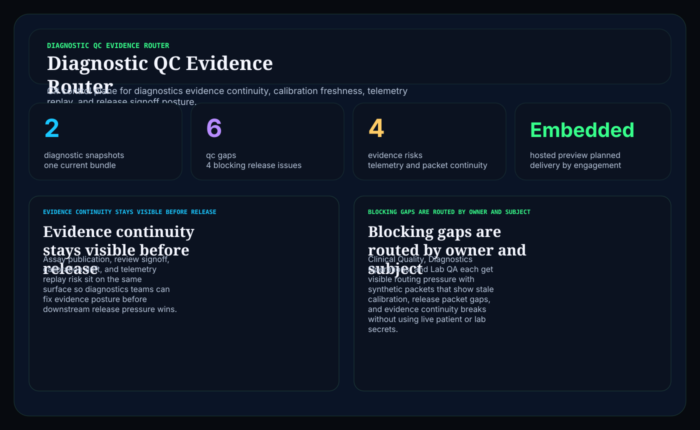
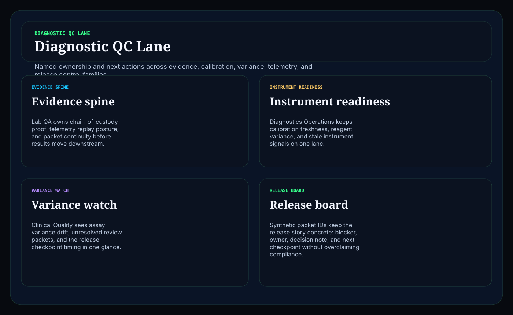
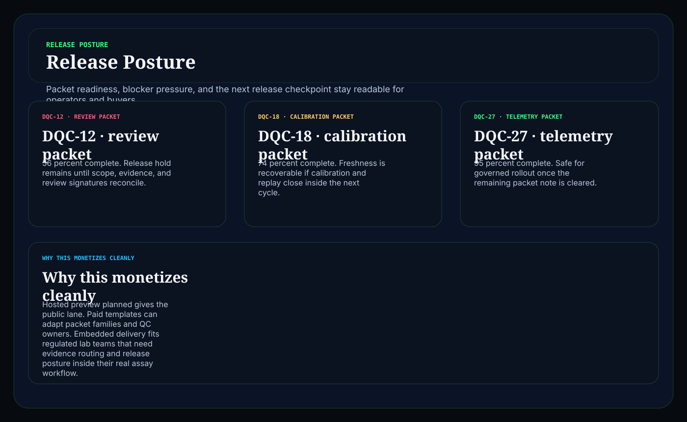

# diagnostic-qc-evidence-router

Biotech / diagnostics operator surface in C# for routing assay QC evidence, calibration drift, telemetry replay gaps, and release-signoff pressure into one readable control plane.

## Why this matters

Diagnostics teams do not need another vague compliance landing page. They need a board that keeps evidence continuity, calibration freshness, telemetry coverage, variance review, and release readiness visible together before weak packets reach publication or downstream clinicians.

This repo is the public proof surface for that pattern:

- `Hosted preview planned` for a browser-based diagnostics evidence router
- `Embedded by engagement` for teams that need the routing model inside a regulated lab or assay workflow

## What it includes

- ASP.NET Core minimal API in C#
- synthetic diagnostics snapshots, QC gaps, and release packets
- operator surfaces for:
  - `/qc-lane`
  - `/evidence-routing`
  - `/release-posture`
  - `/verification`
  - `/docs`
- structured JSON endpoints under `/api/*`
- static Pages export with `robots.txt`, `sitemap.xml`, and `CNAME`

## Screenshots





## Verification

- synthetic diagnostics and assay evidence only
- no patient, clinician, or lab secrets
- no claim of HIPAA, CLIA, CAP, or FDA compliance
- this is a control-plane proof surface for workflow depth, not a compliance certification claim

## Local run

```powershell
dotnet test
dotnet run --project src/DiagnosticQcEvidenceRouter.Api -- --demo
dotnet run --project src/DiagnosticQcEvidenceRouter.Api
```

Then open:

- `http://127.0.0.1:5087/`
- `http://127.0.0.1:5087/qc-lane`
- `http://127.0.0.1:5087/evidence-routing`
- `http://127.0.0.1:5087/release-posture`

## Render static site

```powershell
dotnet run --project src/DiagnosticQcEvidenceRouter.Api -- --prerender
```

## Related docs

- [Embedded framing](./docs/KINETIC_GAIN_EMBEDDED.md)
- [Origin story](./docs/ORIGIN.md)
